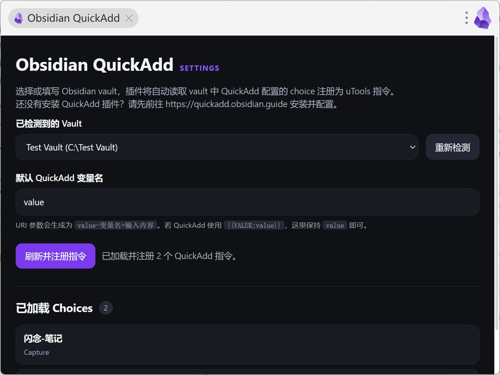
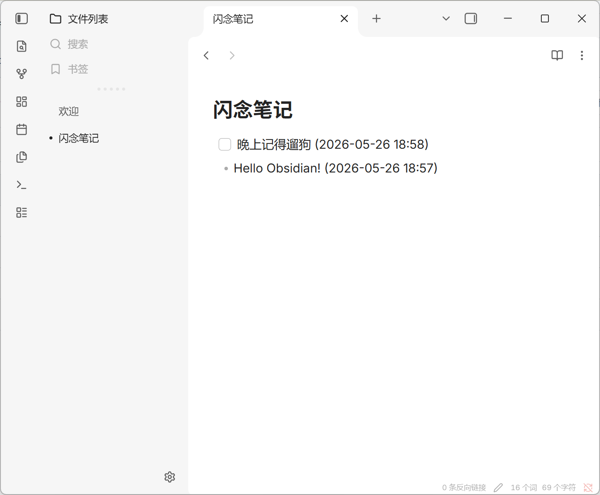
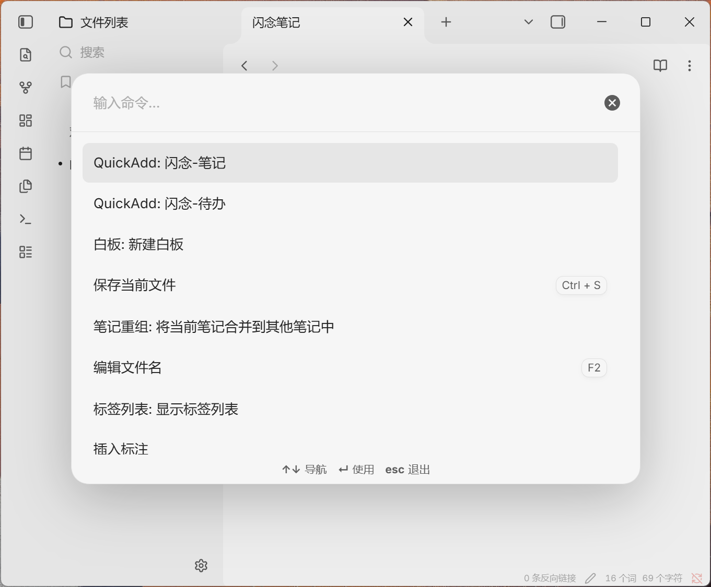

  
  <h1 align="center">uTools 插件 Obsidian QuickAdd</h1>

在 uTools 中全局调用 Obsidian QuickAdd 已配置好的 choice，适合快速记录闪念、待办、日志和模板笔记。

## 特性

- 自动读取 Obsidian vault 列表，也支持手动填写 vault 名称和路径
- 将 QuickAdd choices 动态注册为 uTools 指令
- 支持在 uTools 主输入框输入内容后直接选择 QuickAdd choice 执行
- 支持自定义 QuickAdd 变量名，例如 `{{VALUE:value}}`
- 提供配置页查看已加载的 QuickAdd choices

打开 uTools 后搜索 `Obsidian QuickAdd` 进入配置页。

## 预览

